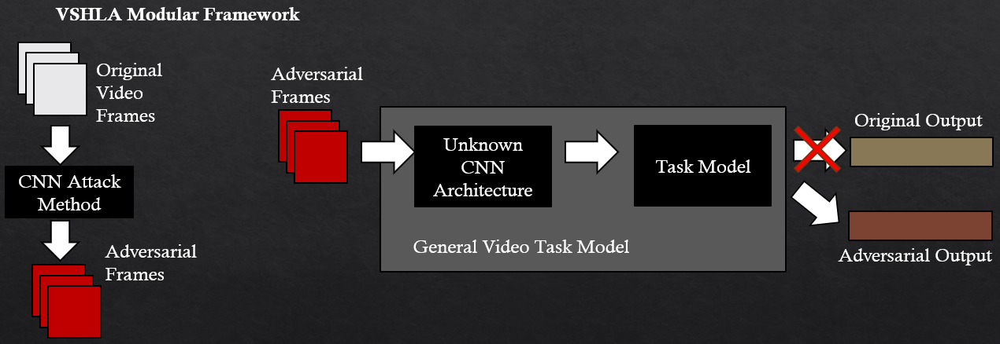

# Deep Learning Computer Vision Final Project

By Suman Kalyan Adari (sa3976@columbia.edu)

Sources:

TREMBA: https://github.com/TransEmbedBA/TREMBA
Imagenette: https://github.com/fastai/imagenette
MSVD Dataset for the 10 base videos
Video Caption Pytorch: https://github.com/w-garcia/video-caption.pytorch

Previous research collab with Washington Garcia (Github user: w-garcia) at the University of Florida

# Project

This project seeks to explore how we can improve the current benchmark of VSHLA, Video Semantic Hard-Label Attack, which currently relies on a state-of-the-art black-box attack method called TREMBA to target the CNN bottleneck in video task models to produce adversarial outputs semantically related to some target.

The following diagram depicts the attack framework of VSHLA:

 

A good portion of the code is ported from my previous research project. I am first author and primary developer of any code here not attributed to TREMBA or Video Caption PyTorch.

What is new with this project:

- Ported and streamlined old code to function better, have less clutter
- Implemented Carlini-Wagner L2 attack [1]
- Modified TREMBA generator under "TREMBA/train_generator_modified.py" to incorporate edge-outlined images into loss function in training process

References:

[1] Nicholas Carlini and David Wagner. Towards Evaluating the Robustness of Neural Networks. In Security and Privacy (SP), pages 582–597, 2016. arXiv: 1608.04644.

# Repository Guide:

### configs/

The configs are split into two sections, one using TREMBA (no suffix) and the other using Carlini-Wagner L2 attack (_CW as suffix).

The TREMBA configs have generator, attack, and evaluation configurations, while the CW configs contain attack and evaluation configurations.

### data/

Holds the training data (imagenette), sample videos used in the attack, as well as the adversarially generated output videos.

### eval_models/

Holds resnet152 and vgg16 pretrained MSVD S2VT+Attention models. These were borrowed from previous research projects from myself, with the training scripts contained inside the video caption pytorch folder.

### results/

Holds the evaluation summaries of attack algorithms on the adversarial videos. This has been split into three partitions: one for baseline, one for modified TREMBA, and one for CW.

### TREMBA/

The base folder for TREMBA which has been modified slightly to work with this project

### video_caption_pytorch

Contains scripts related to video captioning to allow the S2VT to be operational

# How to run

The following packages and programs are all required:

sentence-transformers
PyTorch
FFMPEG
scikit-video
pandas
pretrainedmodels
numpy

Make sure FFMPEG is in path, otherwise it won't be able to be detected.

# Instructions for Graders

If you would like to run some scripts, then try the following notebooks:

Test the attack:
1. commence_attack.ipynb, commence_attack_CW.ipynb
    This should save to data/adversarial_videos
    
    These scripts may take a long time!
    commence_attack.ipynb should be run until you see that it has written outputs. If you keep it going, it will do 33 experiments in total

    commence_attack_CW.ipynb will take 3-4 entire days and nights if you keep it running for the 33 configs. Some experiments can take ~10 minutes, some can take hours.

Evaluate Adversarial:

2. evaluate_video.ipynb, evaluate_video_CW.ipynb
    This should save to results/

    Evaluation should be much faster, will take ~5 minutes to evaluate videos if you're using GPU PyTorch.

Score and Tabulate:

3. score_results.ipynb, score_results_CW.ipynb
    This should save to results/final_results.csv and results_CW/final_results.csv respectively

    Should take a few seconds

## Training GAN (TREMBA)

Make sure you have "imagenette2.tgz" in the data folder. First, extract "here" so that imagenette2.tar shows up. Then, extract here again.
You should have a folder "data/imagenette2" which has "train", "val"

1. First edit train_config.json to tweak paths, epsilon, and anything else.
2. Edit generate_configs_trainattack.py and run it
3. config/ should create a folder "generator" with the new configs.
3. Edit train_attacker.py if needed and execute: python train_attacker.py

## Adversarial Attacks (TREMBA)

1. First edit tremba_attack_config.json to tweak paths, models, etc.
2. Edit generate_configs_trainattack.py as needed and then run it.
3. Commence the attack by running commence_attack.py, editing it if needed.

Results should start popping up in data/adversarial videos

## Evaluating Adversarial Videos

1. Edit these files if needed: evalaute_config.json, generate_evaluate_configs.py, evaluate_video.py

2. First run generate_evaluate_configs.py

3. Then run evaluate_video.py

## Combining and Scoring Results

1. If needed, edit score_results.py and tabulate_final_results.py

2. Run score_results.py

3. Run tabulate_final_results.py 

You can execute view_frames.ipynb to look at specific videos, their frames, and perturbations.

The final results will be saved at results/final_results.csv

The same applies to the _CW versions of the above, just be sure to edit the save directories to avoid overriding any previous results.
